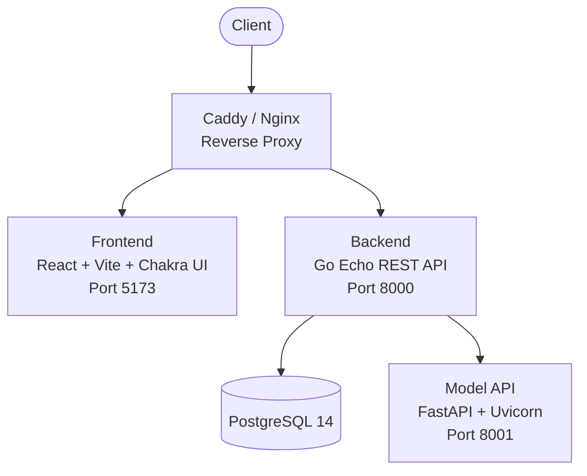

# MacroVision

MacroVision is a full-stack Vietnamese recipe discovery platform. Users photograph their ingredients, an AI detection pipeline identifies them, and the app suggests matching Vietnamese dishes. It also includes dish search, favorites, user accounts, and a meal planner with daily/monthly calendar views.

The project is composed of four main services: a React frontend, a Go REST API backend, a Python ML detection API, and a PostgreSQL database. Supporting tooling includes a recipe web scraper, an image scraper for ingredient photos, and an ingredient grouping utility.

Live at [vision.endstranding.net](https://vision.endstranding.net)

## 1. Architecture



### *1.1. Services overview*

| Service | Language | Framework | Description |
|---------|----------|-----------|-------------|
| `frontend` | JavaScript | React 19, Vite 7, Chakra UI 3 | SPA with routing, auth, ingredient input, recipe browsing, meal planning |
| `backend` (food_db) | Go 1.24 | Echo v4, sqlc | REST API with Swagger docs, session auth, recipe scraping, ingredient processing |
| `model_api` | Python 3.12 | FastAPI, Uvicorn | AI ingredient detection with multiple model backends |
| `database` | SQL | PostgreSQL 14 | Relational store for dishes, ingredients, users, sessions, favorites, meal cards |
| `grouper` | Python | Azure OpenAI Embeddings, scikit-learn | Groups raw ingredient names into semantic categories using embedding similarity |
| `img_scraper` | Go | stdlib, goquery | Scrapes ingredient images from Open Food Facts for dataset building |

### *1.2. Database schema*

The PostgreSQL schema covers eight tables:

| Table | Purpose |
|-------|---------|
| `dishes` | Scraped Vietnamese recipes with name, course, alt name (Vietnamese), description, full recipe text, and source URL |
| `ingredients` | Unique ingredient names |
| `dish_ingredients` | Many-to-many link between dishes and ingredients, with amount and unit |
| `users` | User accounts with bcrypt-hashed passwords |
| `sessions` | Token-based session management with expiration |
| `favorites` | User-dish favorites |
| `meal_cards` | User meal plans tied to a date |
| `meal_cards_dishes` | Many-to-many link between meal cards and dishes |

SQL is managed with [sqlc](https://sqlc.dev), generating type-safe Go code from raw SQL queries.

## 2. AI Detection Pipeline

The model API exposes four detection strategies at `/detect/{method}`, all returning a unified `{ "detections": ["ingredient", ...] }` response. The system recognizes 207 ingredient classes defined in `assets/classes.txt`.

### *2.1. Main Pipeline (Grounding DINO + DINOv2 ArcFace)*

A two-stage approach. Grounding DINO (`IDEA-Research/grounding-dino-tiny`) proposes bounding boxes for food-like regions using the text prompt `"food ingredient ."`. Each crop is then classified by a DINOv2 ViT-S/14 backbone fine-tuned with an ArcFace head, comparing embeddings against pre-computed class prototypes via cosine similarity. This is the primary detection method used in production.

### *2.2. YOLO Detector*

Single-pass YOLOv11 object detection at 640px input size. Fast inference with spatial localization. Limited to ingredients seen during training.

### *2.3. CLIP Detector*

Zero-shot whole-image classification using OpenCLIP ViT-L/14. Text embeddings are built from three prompt templates per ingredient and cached. No bounding boxes, but works without custom training data.

### *2.4. Azure LLM Detector*

Azure OpenAI vision model. The image is base64-encoded and sent with a structured prompt containing all 207 class names. Highest semantic understanding but slowest due to network round-trip and API cost.

### *2.5. Image preprocessing*

Configurable via environment variables. When enabled, images are validated for dimensions (max 4096x4096), file size (max 10 MB), and downscaled to a max long side of 800px before inference.

## 3. Getting Started

### *3.1. Prerequisites*

- Docker and Docker Compose
- Go 1.24+ (for local backend development)
- Node.js LTS (for local frontend development)
- Python 3.12+ (for local model development)
- PostgreSQL 14 (handled by Docker in default setup)

### *3.2. Environment setup*

Each service has a `.env.stub` file showing the required variables. Copy and fill them in:

```sh
# Root (database credentials, ports)
cp .env.stub .env

# Backend
cp food_db/.env.stub food_db/.env

# Frontend
cp frontend/.env.stub frontend/.env

# Model API (Azure OpenAI credentials, preprocessing config)
cp model/.env.stub model/.env

# Grouper (Azure OpenAI credentials for embeddings)
cp grouper/.env.stub grouper/.env
```

Key variables in the root `.env`:

| Variable | Description |
|----------|-------------|
| `FRONTEND_PORT` | Port for the frontend dev server |
| `BACKEND_PORT` | Port for the Go API |
| `POSTGRES_USER` | PostgreSQL username |
| `POSTGRES_PASSWORD` | PostgreSQL password |
| `POSTGRES_DB` | PostgreSQL database name |

The model API requires Azure OpenAI credentials (`AZURE_OPENAI_API_KEY`, `AZURE_OPENAI_ENDPOINT`) and model weight files placed in `model/main/assets/` and `model/yolo/assets/`. See `model/docs/API.md` for the expected file layout.

### *3.3. Running with Docker Compose*

```sh
# Start the core services (frontend, backend, database, adminer)
docker compose up

# Start with the model API
docker compose --profile model up

# Start the ingredient grouper (one-off job)
docker compose --profile grouper up

# Start the image scraper (one-off job)
docker compose --profile scraper up
```

Docker Compose watch mode is configured for the frontend and backend, enabling live reload during development:

```sh
docker compose watch
```

The backend auto-scrapes recipe links and processes them into the database on first startup if no data exists.

### *3.4. Running locally*

For the backend (from `food_db/`):

```sh
go run .
```

The API serves Swagger docs at the domain root, redirecting to `/docs/`. The REST API is versioned under `/v1`.

For the frontend (from `frontend/`):

```sh
npm install
npm run dev
```

For the model API (from project root):

```sh
python -m venv .venv
# Windows: .venv\Scripts\activate
# Unix: source .venv/bin/activate
pip install -r model/requirements.txt
uvicorn model.api:app --port 8001
```

### *3.5. Adminer*

A database admin UI is available at `localhost:8080` when running Docker Compose, connecting to the PostgreSQL container.

## 4. Deployment

### *4.1. CI/CD*

A GitHub Actions workflow (`.github/workflows/deploy.yaml`) deploys on push to the `prod` branch. It:

1. Authenticates with AWS via OIDC
2. Ensures an EC2 instance exists (creates one if not)
3. SSHs into the instance, pulls the latest code, builds with `compose.prod.yaml`, and starts the services
4. Updates Cloudflare DNS if the instance IP changed

### *4.2. Production stack*

In production, the frontend is built as a static bundle served by Nginx. Caddy acts as the reverse proxy with automatic HTTPS, routing `/api/*` to the backend and everything else to the frontend. The compose.prod.yaml uses ECR for container images with build caching.

## License

MIT License. See [LICENSE](LICENSE) for details.
